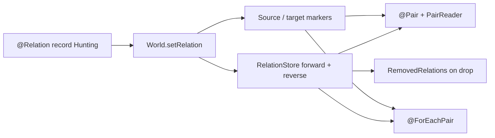

# Relations: Overview

> Relations model typed edges between entities — "this predator is hunting that
> prey", "this unit is garrisoned in that building", "this entity is a child of
> that one". The data for every edge lives in a non-fragmenting side-table with
> forward and reverse indices and automatic archetype-marker maintenance.

## Why not a `HashMap<Entity, Entity>`?

You can always stash a target entity inside a component:

```java
public record Hunting(Entity target, int ticksLeft) {}
```

That works for a handful of edges, but it breaks down fast:

1. **Only one edge per source.** The moment you need "this predator is
   hunting three prey" you're stuffing a `List<Entity>` into a component.
2. **No reverse lookup.** Asking "who is currently hunting entity X?"
   requires a linear scan over every predator that owns a `Hunting`.
3. **No archetype filter.** Queries can't narrow to "entities that
   currently have at least one outgoing `Hunting` pair" without you
   hand-rolling a marker component.
4. **No cleanup.** When the prey despawns, every dangling `Hunting` still
   holds its stale entity id. You have to go find them yourself.
5. **No change signal.** There's no "a pair was removed" event — no hook
   to decrement a score, release a reservation, invalidate a cache.

Relations solve all five. The fragmentation-free storage is the same one
used for components, but keyed on `(source, target)` instead of on a
single entity, and the forward index, reverse index, and archetype
markers are all maintained automatically by `World`.

## The four moving parts

Every relation type you use touches exactly four pieces of the API.

### 1. The `@Relation` annotation on a payload record

```java
import zzuegg.ecs.relation.Relation;

@Relation
public record Hunting(int ticksLeft) {}
```

`@Relation` is a class-level marker that opts a record into the
relation-storage backend. The record is still a plain Java record — it
can carry any fields you like, and those fields become the per-pair
payload.

The annotation has one optional argument, `onTargetDespawn`, which
picks the cleanup policy for this relation type. It's covered in
detail in [Cleanup policies](20-cleanup-policies.md).

### 2. `world.setRelation(source, target, payload)`

```java
Entity predator = world.spawn(new Position(0, 0), new Predator(5));
Entity prey     = world.spawn(new Position(3, 4), new Prey(0));

world.setRelation(predator, prey, new Hunting(3));
```

`setRelation` is the only thing you need to call to create a pair. It:

- registers the relation store lazily if this is the first pair of
  type `Hunting`,
- writes the payload into the forward index under `(predator, prey)`,
- mirrors `predator` into the reverse index under `prey`,
- adds the source-side archetype marker to `predator` if this is its
  first outgoing `Hunting` pair,
- adds the target-side archetype marker to `prey` if this is its
  first incoming `Hunting` pair,
- bumps the per-pair change-tracker tick.

You can also go through `Commands.setRelation(source, target, payload)`
from inside a system body — the command buffer flushes at the next
stage boundary, which is the only safe way to mutate the relation
store while iterating it.

### 3. `RelationStore` — the forward + reverse index layer

You'll rarely touch `RelationStore` directly, but it's what sits
underneath everything else. Its responsibilities:

- hold the forward index: source id → flat `(target, payload)` slice,
- hold the reverse index: target id → flat source-id slice,
- own a per-type `PairChangeTracker` so `@Added` / `@Changed` filters
  can fire at pair granularity,
- own a per-type `PairRemovalLog` so `RemovedRelations<T>` can drain
  dropped pairs per tick,
- expose `forEachPairLong` for exclusive systems that want to scan
  every live pair without per-entity dispatch.

All of these are primitive-keyed (`long` entity ids, raw arrays) so
the hot path avoids `HashMap.Entry` allocation and `Entity.hashCode`
calls. The data structure is the cheapest thing the benchmark could
build — see the source in
`ecs-core/src/main/java/zzuegg/ecs/relation/RelationStore.java`.

### 4. Automatic archetype markers

When you register a relation type, `ComponentRegistry` allocates **two**
internal marker component ids:

- the **source marker** — added to every entity that has at least
  one outgoing pair of this relation type,
- the **target marker** — added to every entity that has at least
  one incoming pair.

These markers never carry data. They exist so the archetype-filter
layer can narrow a system's match set to "entities currently
participating in a relation" without you writing a `With<Marker>`
by hand. `World.setRelation` and `World.removeRelation` maintain
them, including the first-pair / last-pair transitions, so you
never see the markers in application code.

## Two ways to dispatch a system over pairs

Once you have pairs in the store, you pick one of two dispatch
models to write a system against them.

| Feature                       | `@Pair(T.class)`                                  | `@ForEachPair(T.class)`                                       |
|-------------------------------|---------------------------------------------------|---------------------------------------------------------------|
| Unit of dispatch              | Once per entity with ≥ 1 pair                     | Once per live pair                                            |
| Iteration style               | **Set-oriented** — body walks pairs itself        | **Tuple-oriented** — framework feeds one pair per call        |
| Walker API                    | `PairReader<T>` service parameter                 | None — parameters bind directly to source/target              |
| Source-side component access  | Regular `@Read` / `@Write` on system              | `@Read` / `@Write` on the method                              |
| Target-side component access  | Look up manually via `ComponentReader` if needed  | `@FromTarget @Read Component`                                 |
| Archetype narrowing           | Yes — source marker (or target marker if `role = TARGET`) | Yes — source marker (iteration drives dispatch)       |
| Multiple pairs per source     | Natural — walker returns an `Iterable`            | Natural — method fires once per pair                          |
| Best for                      | "Do some entity-level work, then walk its pairs"  | "Apply the same action to every pair uniformly"               |
| Tier-1 generated?             | No — walker-driven                                | Yes — `GeneratedPairIterationProcessor` emits bytecode        |

Rule of thumb:

- If the per-pair work dominates the system, prefer `@ForEachPair` —
  the tier-1 generator emits a `run(long tick)` method with a direct
  `invokevirtual` to your body, no walker, no reflection. See
  [@ForEachPair](19-for-each-pair.md).
- If the entity needs setup that's *shared* across all its pairs (a
  single AI evaluation that then fans out into per-pair commands),
  prefer `@Pair`. See [`@Pair` and `PairReader`](18-pair-and-pair-reader.md).

!!! tip "Both work — pick based on what the body does"
    Neither dispatch model is a performance trap. `@Pair` is cheaper
    for entities that happen to have zero pairs (archetype filter skips
    them entirely). `@ForEachPair` is cheaper when you do touch every
    pair (no walker allocation per source). The benchmark at
    `PredatorPreyForEachPairBenchmark` runs the same workload through
    both for direct comparison.

## Everything connected, at a glance



## A first end-to-end snippet

Just so you have one concrete picture before the chapters dive
in — here's the smallest possible program that creates a
relation, queries it, and observes it being dropped.

```java
import zzuegg.ecs.entity.Entity;
import zzuegg.ecs.relation.Relation;
import zzuegg.ecs.world.World;

@Relation
public record Likes() {}

World world = World.builder().build();

Entity alice = world.spawn();
Entity bob   = world.spawn();
Entity carol = world.spawn();

// Alice likes Bob and Carol. Two pairs under the same relation type.
world.setRelation(alice, bob,   new Likes());
world.setRelation(alice, carol, new Likes());

// Ask the store directly — in real code this goes through
// PairReader<Likes> or @ForEachPair(Likes.class).
var store = world.componentRegistry().relationStore(Likes.class);
System.out.println("alice has " + /* ... */ " pairs");

// Dropping Bob drops the (alice, bob) pair via RELEASE_TARGET —
// the default. Alice survives, still likes Carol.
world.despawn(bob);
```

That's the whole API surface at this level: annotate the record,
call `setRelation`, hand the store to a system. The rest of the
section unpacks what each of the three lines above actually does
and how to make them fast.

## What you learned

!!! summary "Recap"
    - Relations are typed edges between entities, stored in a
      non-fragmenting side-table with forward + reverse indices.
    - The `@Relation` annotation marks the payload record and
      configures its cleanup policy.
    - `world.setRelation(source, target, payload)` creates a pair and
      maintains archetype markers automatically.
    - Two dispatch models — set-oriented `@Pair` + `PairReader`, and
      tuple-oriented `@ForEachPair` — cover different system shapes.

## What's next

!!! tip "Next chapter"
    The set-oriented dispatch. Start with
    [`@Pair` and `PairReader`](18-pair-and-pair-reader.md) — it's the
    simpler of the two and it introduces the marker filter you'll see
    again in `@ForEachPair`.
